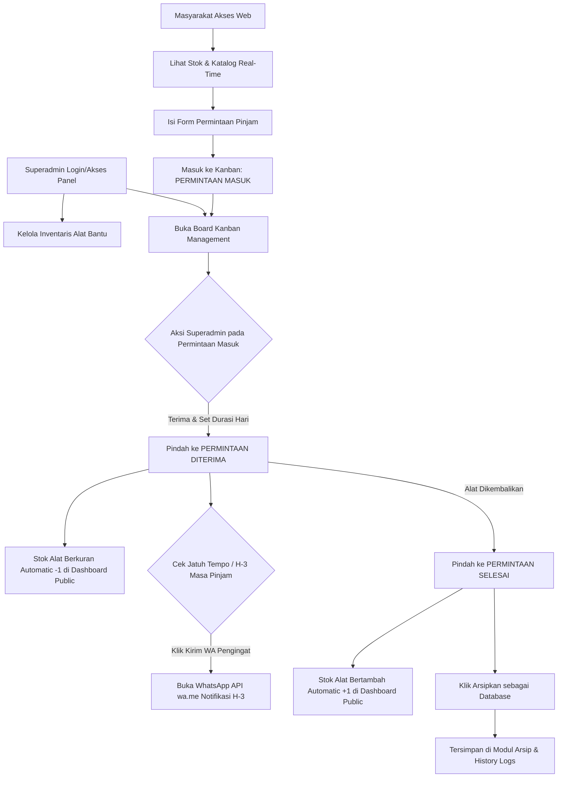

# Rencana Pengembangan Web Application
# PERISAI Temon - Teman Disabilitas

**Lokasi Proyek:** `D:\Temon\temon-teman-disabilitas`  
**Target Pengguna:** Superadmin Kapanewon Temon & Masyarakat Umum Kapanewon Temon  
**Tujuan Utama:** Pengelolaan inventarisasi, transparansi ketersediaan, serta sistem permohonan pinjam alat bantu disabilitas berbasis Kanban terpadu dengan integrasi Pengingat WhatsApp.

---

## 1. Ikhtisar Sistem & Visi Aplikasi

**PERISAI Temon (Teman Disabilitas)** adalah aplikasi berbasis web yang dirancang khusus untuk Kapanewon Temon, Kabupaten Kulon Progo, guna mengoptimalkan distribusi dan peminjaman alat bantu disabilitas (seperti kursi roda, kruk, walker, alat bantu dengar, dll.).

Sistem ini memfasilitasi dua peran utama:
1. **Masyarakat Umum (Tanpa Login):** Memantau stok alat bantu secara real-time berdasarkan kelurahan/sumber, dan mengajukan formulir peminjaman secara mandiri.
2. **Superadmin (Pengelola Kapanewon):** Menginput inventaris alat bantu disabilitas, mengelola alur peminjaman dengan **Kanban Board** 3 tahap, memicu pengingat peminjaman H-3 via WhatsApp API, serta mengarsipkan riwayat transaksi ke database permanent.

---

## 2. Arsitektur Teknis & Arsitektur Data

### 2.1 Technology Stack
- **Frontend Framework:** React 18 + Vite (Performa tinggi, modul cepat & responsif)
- **Styling & Design System:** Tailwind CSS v3 + Custom Modern Glassmorphism & Micro-animations
- **Iconography & UI Components:** Lucide-React + Headless Components
- **State & Database Persistence:** LocalStorage / IndexedDB Wrapper (Data tersimpan persistent di browser admin/perangkat, siap dikoneksikan ke Backend REST/Supabase di masa depan)
- **Integrasi WhatsApp:** Dynamic Direct Link (`wa.me`) dengan template pesan otomatis.

### 2.2 Struktur Data (Data Models)

#### A. Model Inventaris Alat Bantu (`DisabilityEquipment`)
```typescript
interface DisabilityEquipment {
  id: string;
  namaAlat: string;
  jenisAlat: 'Kursi Roda' | 'Kruk / Alat Bantu Jalan' | 'Alat Bantu Dengar' | 'Alat Bantu Penglihatan' | 'Kasur Decubitus' | 'Lainnya';
  foto: string; // URL / Base64 image
  pemilik: string; // contoh: Dinsos Kulon Progo, Kapanewon Temon, Donatur Warga, Hibah CSR
  statusUtama: 'Tersedia' | 'Dipinjamkan' | 'Hibah' | 'Perbaikan';
  stokTotal: number;
  stokTersedia: number; // berkurang otomatis saat permintaan diterima, bertambah saat selesai
  deskripsi: string;
  kondisi: 'Baik' | 'Perlu Perbaikan Sedikit';
  tanggalDiinput: string;
}
```

#### B. Model Permintaan Peminjaman (`LoanRequest`)
```typescript
interface LoanRequest {
  id: string;
  kodeBooking: string; // Kode unik contoh: PRSI-2026-001
  equipmentId: string;
  namaAlat: string;
  
  // Data Form Pemohon (Diisi oleh Masyarakat)
  namaPemohon: string;
  alamatPemohon: string; // Termasuk Kelurahan di Temon (Glagah, Palihan, Temon Kulon, dll)
  nomorWaPemohon: string; // No WA aktif (e.g., 08123456789)
  namaPenggunaAlat: string; // Nama disabilitas penerima manfaat
  catatanKebutuhan?: string;

  // Status Kanban Logic
  stage: 'permintaan_masuk' | 'permintaan_diterima' | 'permintaan_selesai';
  
  // Detail Peminjaman (Diisi saat Superadmin Menerima Permintaan)
  durasiHariPinjam?: number; // e.g., 30 hari
  tanggalMulaiPinjam?: string;
  tanggalJatuhTempo?: string; // Tanggal Kembali
  
  // Fitur WhatsApp Reminder
  statusWaReminderSent?: boolean;
  
  // Status Arsip
  isArchived: boolean;
  tanggalSelesai?: string;
  tanggalPengarsipan?: string;
  catatanPengembalian?: string;
}
```

---

## 3. Fitur Utama & Logic Alur Kerja



### 3.1 Halaman Publik (Tanpa Login)
1. **Hero Header Banner:** Slogan PERISAI Temon, statistik singkat ketersediaan alat, tombol panduan peminjaman.
2. **Katalog Stok Alat Bantu Real-Time:**
   - Pencarian berdasarkan nama alat & filter kategori (Mobilisasi, Pendengaran, Penglihatan).
   - Display kartu interaktif: Foto alat, Jenis, Pemilik, Chip Status (Tersedia / Dipinjam / Hibah), dan indikator **Stok Tersedia**.
3. **Modal Form Permintaan Peminjaman:**
   - Pemilihan Alat Bantu yang tersedia.
   - Form Validasi Input:
     - Nama Pemohon
     - Alamat Pemohon (Kelurahan & RT/RW di Kapanewon Temon)
     - Nomor WhatsApp Aktif (Format otomatis terkonversi ke 628xxx)
     - Nama Pengguna Alat Bantu Disabilitas
     - Catatan/Kebutuhan Khusus

### 3.2 Halaman Dashboard & Inventaris Superadmin
1. **Manajemen Alat Bantu Disabilitas (CRUD):**
   - Tambah data alat baru (Nama, Jenis, Upload Foto / URL Foto, Pemilik, Stok Total, Status).
   - Edit & Hapus data alat.
2. **Logic Kanban Board 3 Kolom:**
   - **Kolom 1: Permintaan Masuk (Incoming Requests):**
     - Menampilkan request baru dari pemohon.
     - Superadmin dapat meninjau detail pemohon.
     - Tombol **"Terima & Tentukan Masa Pinjam"**: Membuka modal durasi (misal: 14 hari, 30 hari, atau custom date).
     - Saat dipindahkan ke *Permintaan Diterima*, **Stok Alat yang bersangkutan berkurang (-1)** secara otomatis di dashboard publik.
   - **Kolom 2: Permintaan Diterima (Active Loans):**
     - Menampilkan info pemohon, tanggal mulai, tanggal jatuh tempo, dan sisa hari.
     - Highlight badge otomatis jika masa pinjam tersisa **<= 3 Hari**.
     - **Tombol "Kirim WA Pengingat (H-3)"**: Membuka aplikasi WhatsApp dengan pesan terformat otomatis yang menyebutkan nama pemohon, jenis alat, dan tanggal harus kembali.
     - Tombol **"Selesaikan Peminjaman"**: Memindahkan request ke *Permintaan Selesai*.
   - **Kolom 3: Permintaan Selesai (Completed Loans):**
     - Begitu request masuk ke kolom ini, **Stok Alat yang bersangkutan bertambah (+1)** kembali secara otomatis di dashboard publik.
     - Tombol **"Arsipkan sebagai Database"**: Menghapus kartu dari board aktif dan memasukkannya ke database riwayat/arsip permanen.
3. **Modul Arsip & Database History:**
   - Laporan tabel seluruh peminjaman yang sudah selesai & diarsipkan.
   - Pencarian data histori berdasarkan Pemohon, Alat, Kelurahan, atau Rentang Tanggal.
   - Export data laporan ke CSV/Excel.

---

## 4. Rencana Desain UI/UX & Estetika
- **Tema Warna:** *Temon Emerald & Ocean Blue* (Memberikan kesan hangat, ramah disabilitas, profesional, dan tepercaya).
- **Aksesibilitas (Disability-Friendly):** High contrast toggle, font ukuran adaptif, tata letak luas dan jelas.
- **Glassmorphism & Cards:** Card inventaris modern dengan efek hover halus, badge status beranimasi glow soft.
- **Responsif:** 100% responsif di layar Smartphone (petugas lapangan/masyarakat) maupun PC/Tablet (superadmin).

---

## 5. Tahapan Implementasi (Roadmap Execution)

| Tahap | Aktivitas Utama | Output |
|---|---|---|
| **Tahap 1** | Inisialisasi Proyek Vite + React + Tailwind CSS di `D:\Temon\temon-teman-disabilitas` | Structure Codebase & Dependencies |
| **Tahap 2** | Pembuatan Design System, Color Tokens, dan Layout Komponen Utama | `index.css`, `Navbar`, `Footer`, `Sidebar` |
| **Tahap 3** | Pembangunan Database Storage Layer & Seed Data Awal Kapanewon Temon | Mock Data Alat & Request Peminjaman |
| **Tahap 4** | Pembuatan Halaman Publik: Catalog, Card Stok Real-Time, & Modal Form Permintaan | Web View Publik Siap Pakai |
| **Tahap 5** | Pembuatan Panel Superadmin: CRUD Inventaris Alat & Kanban Board Logic | Modul Admin Siap Pakai |
| **Tahap 6** | Integrasi Logic Kanban, Stok Auto-Decrement/Increment, & WA Reminder Generator | Logic bisnis 100% terintegrasi |
| **Tahap 7** | Modul Arsip Database & Pengujian Komprehensif (End-to-End Test) | Aplikasi Finis & Siap Rilis |

---

*Dokumen Perencanaan ini dibuat untuk menjadi acuan utama pengembangan aplikasi PERISAI Temon Teman Disabilitas di folder `D:\Temon\temon-teman-disabilitas`.*
